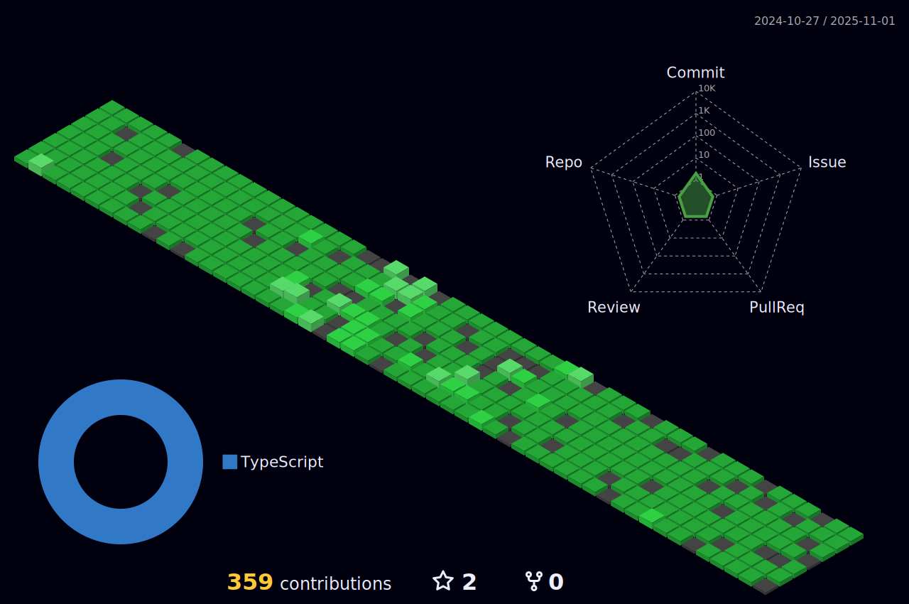

  

###

###

  

 

  
  
  
  
  
  
  
  
  
  
  
  
  
  
  

###

    
    
    
    
    
    
    
    
    
    
    
    
    
    
    
    
    
    
    
    
    
    
    
    

  
  

  

